<div align="center">



# Kite Desktop

</div>

<div align="center">


_A desktop-first Kubernetes management application rebuilt with Wails v3_

[中文说明](./README_zh.md)

</div>

## Acknowledgement

This project is based on the original open source project [Kite](https://github.com/kite-org/kite).

Special thanks to the original Kite authors and contributors. The upstream project provided the core product foundation, including Kubernetes resource management, cluster workflows, backend capabilities, and the initial product direction. This repository stands on top of that work.

## Why This Repository Exists

`Kite Desktop` is not a simple mirror of the original repository.

It is a desktop-focused rework built from the original Kite codebase, with the goal of turning it into a native desktop application for Kubernetes management. The focus is shifting from a browser/server-first form into a local, installable, desktop-first product.

## Tech Stack

The current desktop direction is built around:

- `Go` for backend logic and Kubernetes integration
- `React` for the application UI
- `Wails v3` for desktop runtime, native windowing, system integration, and desktop packaging

`Wails v3` is the key part of this transition. It is the foundation for native dialogs, local file access, external link handling, window behavior, and installer packaging for macOS and Windows releases.

## Project Direction

From this point forward, this repository will gradually separate from the upstream Kite project and evolve independently for desktop use cases.

That means:

- desktop-native capabilities will continue to be added
- some web-first or server-first behavior may be reduced, adjusted, or removed
- interaction flows will be optimized for local desktop usage
- release, packaging, and installation experience will become first-class concerns

## Current Positioning

The current goal is practical:

build a usable desktop edition first, then continue iterating specifically for desktop scenarios.

This repository is therefore best understood as:

an independent desktop-oriented branch that started from Kite, thanks Kite, and now continues in its own direction.

## Development

Install dependencies:

```bash
make deps
```

Run the desktop app in development mode:

```bash
make dev
```

Build the desktop app:

```bash
make build
```

## Current Desktop Capabilities

The current desktop runtime already includes:

- explicit runtime identity via `APP_RUNTIME=desktop-local`
- backend-driven local desktop user identity
- single instance activation
- tray and application menu
- window hide-on-close and window state restore
- native file open/save flows for desktop-specific actions
- open config/log directories from the desktop host

Reference docs:

- [Desktop Runtime Contract](./docs/desktop-runtime-contract.md)
- [Desktop Feature Boundary](./docs/desktop-feature-boundary.md)

## Release Targets

The project is being prepared around desktop distribution, including:

- macOS Intel
- macOS Apple Silicon
- Windows x64
- Windows ARM64

## Relationship With Upstream

To be explicit:

- full respect and thanks go to the original Kite project
- this repository is a desktop-focused derivative work
- future feature additions and removals will be driven by desktop needs
- this repository will continue as an independent desktop product direction

## License

This repository continues to follow the existing project license. See [LICENSE](./LICENSE).
